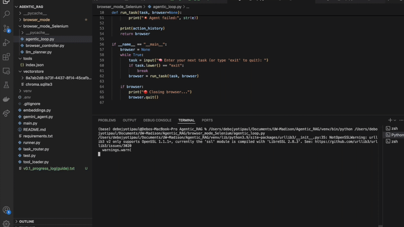

# Cosmos — Local AgenticRAG Task Automation (v0.1-Alpha)

<p align="center">
  
  
</p>

**Project Cosmos** is an experiment in building a fully autonomous local-first agent that can perform tasks like web browsing and desktop actions with traceable, deterministic steps — not hallucinated code dumps. It combines:
- A lightweight Playwright-based browser controller
- A planner loop powered by an LLM (Gemini)
- A feedback-driven agentic execution model

> "task → plan → act → check → repeat"

## 🔎 What Can It Do?

Currently supports basic web automation like:
- Typing into Google, submitting a search
- Clicking on visible elements by description
- Following links on YouTube, Wikipedia, Reddit, etc.
- Simulating user behavior like scroll + click

In short, it can complete **simple, deterministic browser tasks** with traceable planning and checks after each step.

---

## Goal & Philosophy

Goal was to make a project more than a "just call ChatGPT" project.
We want agents that:
- Work locally (LLM as planner, not executor)
- Execute step-by-step, visibly
- Know if their actions changed the page
- Are pluggable into future tools (Spotify, file system, etc.)

Inspired by:
- ChatGPT Operator
- AutoGPT — but simplified, focused, and more deterministic

---

## Project Structure

```
debojp-agenticrag-alpha-project-cosmos/
├── main.py                 # Main CLI router for tasks & tool launching
├── embeddings.py           # SentenceTransformer helper
├── runner.py               # Run generated tool scripts
├── task_router.py          # Vector-search for tool matching
├── browser_mode/           # Main Playwright-based agentic browser
│   ├── agentic_loop.py     # LLM planner loop
│   ├── browser_controller.py # DOM interaction engine
│   └── llm_planner.py      # Gemini planner (LLM calls)
├── tools/                  # Local tool scripts (e.g. Spotify skip)
└── vectorstore/            # Chroma-based vector memory
```

## RAG + Tool Indexing
This project uses a local vector database (ChromaDB) to match user-described tasks with relevant tools. It’s our lightweight implementation of Retrieval-Augmented Generation (RAG) — but focused on tool discovery, not document Q&A.

How it works:
Descriptions of available tools (in tools/index.json) are embedded using SentenceTransformers.
These embeddings are stored in ChromaDB (vectorstore/).
When a user gives a task, we vector-search for the most semantically similar tool.
The matched tool is passed into the LLM for script generation (in main.py mode), or routed directly.

Why?
Most agent projects rely on a hardcoded if/else routing system. I wanted ours to be is smarter. If you type:

`“skip to the next song on Spotify”`

It doesn’t guess. It retrieves the closest-matching tool (spotify_skip) based on natural language meaning, not string matching.

This allows you to: _Add new tools by just describing them, avoid rigid command lists and scale easily_

Files that power this:
- task_router.py → RAG core (vector insert + search)
- embeddings.py → SentenceTransformer wrapper
- tools/index.json → Descriptions + paths for each tool
- vectorstore/ → Chroma persistence

Future versions will use this same idea to retrieve: _UI element memories, Task flows, Success histories (e.g. “what worked on YouTube last time?”), etc._

---

## How It Works (Browser Mode)

1. **State**: We extract visible DOM state (clickables, inputs, text, titles)
2. **Planning**: We send this to Gemini to get a structured plan:
```json
{ "action": "click", "index": 3 }
```
3. **Execution**: We act on that plan, using internal DOM knowledge
4. **Check**: After each step, we compare DOM to see if anything changed

If nothing changes? Retry or backtrack in future iterations.

---

## Cool Engineering Ideas

- Replaced selector-based clicks with index-based action (reduce hallucination)
- Tracked action history to prevent infinite loops
- Added before/after DOM state diffing for action validation
- Filtered noisy elements (ads, headers, logos) from LLM inputs
- DOM size increased on scroll to load more content

---

## Current Limitations

- Fails on pages with deeply nested JS-only links (e.g. YouTube thumbnails)
- Typing fails if selector is wrong or field is hidden
- LLM doesn’t always choose meaningful actions (non-deterministic)
- Gemini sometimes outputs broken JSON (we patch it)
- CAPTCHA blockers still happen occasionally

This project works best as a **teaching demo**, a base for building more.

---

## Roadmap (Summer 2025)

- [ ] Better query typing and search validation
- [ ] Retry + backtracking system
- [ ] Per-site tuning via vector memory (RAG for behavior)
- [ ] Add vision (screenshot parsing)
- [ ] Add voice-agent routing
- [ ] Desktop tools (file handling, app control)

---

## Try It Out
If you’re curious and want to test it out yourself, you can! Clone the repo, install dependencies from requirements.txt, and then run either main.py (for tool-based execution) or browser_mode/agentic_loop.py (for browser automation directly).
Before running anything, make sure to:
Create a `.env` file as such:
```
GOOGLE_API_KEY=your_key_here
MODEL_NAME=gemini-pro
```

And run:
```bash
pip install -r requirements.txt
python main.py
```

Heads up: You may run into a few dependency hiccups depending on packages pre-installed(or other issues). Troubleshoot as needed and it should work. The setup is intentionally minimal.

Once you're set up, run your agent and start giving it tasks. It should type, click, and navigate the browser based on natural language commands.

> This is an **agent loop**, not just a script. Expect quirks, watch it think.

Everything lives in: `debojp-agenticrag-alpha-project-cosmos/`

Development will. Drop by in end-of-summer, maybe there you will see new updates.
Pull requests and cool ideas are welcome.

